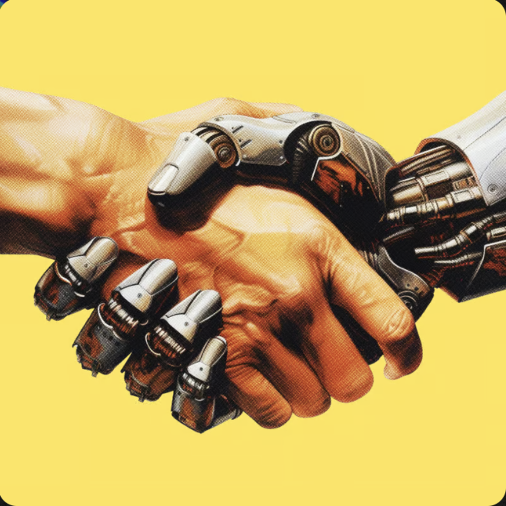

# Organized Agents 🤝🤖

**The world's first comprehensive parallel agentic development education system**

Organized Agents is a powerful desktop application that transforms how you coordinate AI agents for accelerated development. Built with Tauri 2 and featuring a beautiful React frontend, it provides your command center for managing multiple AI agents, creating sophisticated workflows, and mastering parallel development coordination.



## 🌟 What Makes Organized Agents Special

Organized Agents comes pre-loaded with **12 sophisticated development agents** designed for enterprise-grade parallel coordination:

### 🎯 Core Mastery Agents
- **Codebase Mastery Agent** - Deep codebase understanding and navigation
- **Debug Mastery Agent** - Advanced debugging and error resolution
- **Environmental Mastery Agent** - Development environment optimization
- **Testing Revolution Agent** - Comprehensive testing strategies
- **Documentation Revolution Agent** - Automated documentation generation

### 🤝 Coordination Agents  
- **Parallel Planning Agent** - Multi-agent project orchestration
- **Connection Mastery Agent** - Inter-agent communication optimization
- **Gemini Orchestrator Agent** - Claude Code + Gemini CLI coordination
- **Review Mastery Agent** - Code review and quality assurance

### 🛠️ Utility Agents
- **Git Commit Bot** - Automated version control
- **Security Scanner** - Security analysis and vulnerability detection  
- **Unit Tests Bot** - Automated test generation

## 🚀 Features

- **Pre-installed Agent Library**: 12 enterprise-grade agents ready to use
- **Session Management**: Visual timelines and checkpoints for agent coordination
- **Secure Sandboxing**: Safe execution of agent workflows
- **Cross-Platform**: Native apps for macOS, Windows, and Linux
- **Beautiful UI**: Modern React interface with Tailwind CSS
- **Agent Orchestration**: Coordinate multiple agents simultaneously
- **Progress Tracking**: Monitor agent performance and outcomes

## 📦 Installation

### Prerequisites

- **Rust** (latest stable version)
- **Bun** (for package management)
- **Git** 

### Quick Start

```bash
# Clone the repository
git clone https://github.com/Organized-AI/organized-agents.git
cd organized-agents

# Install dependencies
bun install

# Start development server
bun run tauri dev

# Build for production
bun run tauri build
```

## 🎓 Learning Path

Organized Agents is designed for the **23-week progression from beginner to parallel agent master**:

### Foundation (Weeks 1-11)
- Single agent mastery
- Basic coordination patterns
- Development environment setup

### Pair Coordination (Weeks 12-15)  
- Two-agent workflows
- Claude Code + Gemini CLI coordination
- Simple parallel tasks

### Team Coordination (Weeks 16-19)
- Multi-agent orchestration
- Complex project coordination
- Advanced workflow patterns

### Full Orchestra (Weeks 20-22)
- Enterprise-grade coordination
- 5+ agent simultaneous workflows
- Production deployment patterns

### Certification (Week 23)
- Master-level project completion
- Portfolio development
- Community contribution

## 🛠️ Agent Development

Create custom agents by adding `.claudia.json` files to the `cc_agents/` directory:

```json
{
  "name": "My Custom Agent",
  "description": "Description of what this agent does",
  "system_prompt": "Your agent's system prompt here",
  "model": "claude-sonnet",
  "tools": ["filesystem", "terminal", "browser"]
}
```

## 🔧 Configuration

Organized Agents automatically detects your development environment and configures agents accordingly. Key features:

- **Auto-detection** of Claude Code, Gemini CLI, and other tools
- **Environment variable** management for API keys
- **Project-specific** agent configurations
- **Secure storage** of credentials and session data

## 🤝 Contributing

We welcome contributions! Whether you're:
- Creating new agents
- Improving the UI/UX  
- Adding new coordination patterns
- Enhancing documentation
- Reporting bugs

Please see our [Contributing Guide](CONTRIBUTING.md) for details.

## 📄 License

This project is licensed under the AGPL License - see the [LICENSE](LICENSE) file for details.

## 🌐 Community

- **GitHub**: [Organized-AI/organized-agents](https://github.com/Organized-AI/organized-agents)
- **Website**: [organizedai.vip](https://organizedai.vip)
- **Events**: [lu.ma/Organizedai](https://lu.ma/Organizedai)

## 🎯 Roadmap

- [ ] Advanced agent marketplace
- [ ] Cloud synchronization
- [ ] Team collaboration features
- [ ] Enterprise security enhancements
- [ ] Mobile companion app
- [ ] Integration with popular IDEs

---

**Built with ❤️ by BHT Labs / Organized AI**

*Transforming development through intelligent agent coordination*
